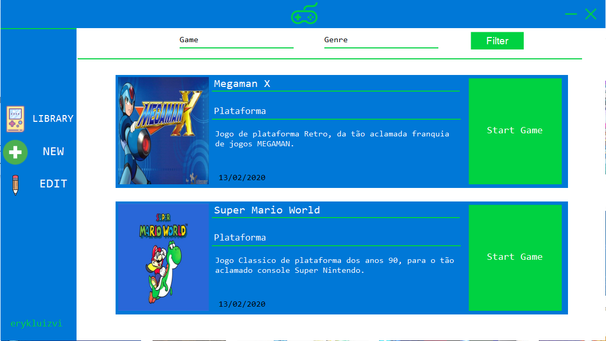
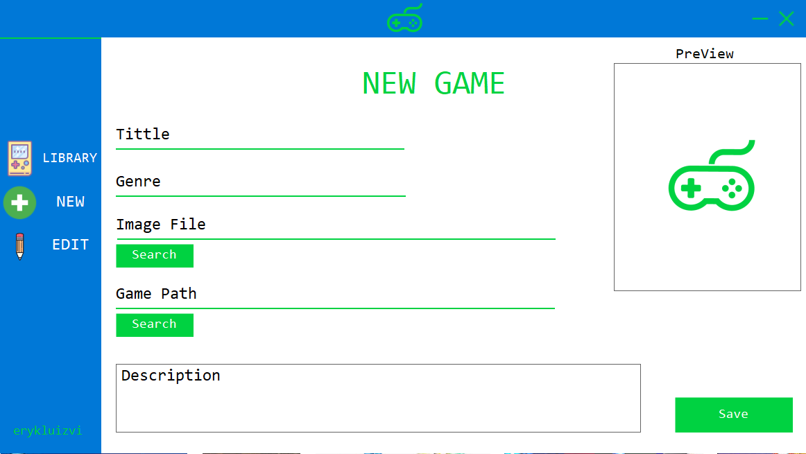
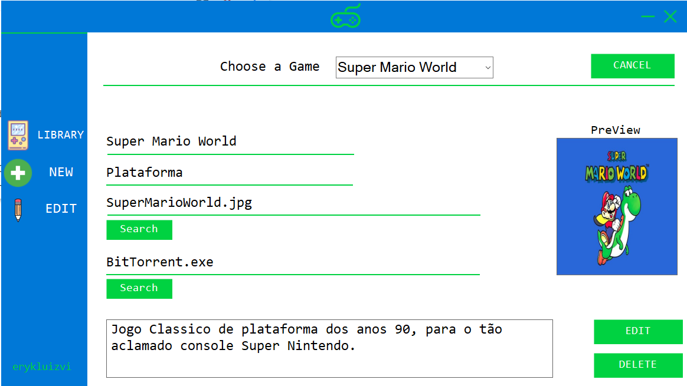

# Csharp-Game-Library

Biblioteca de jogos feita em C# (.Net Framework).

Aplicação desenvolvida com o intuíto de estudo pessoal, feita com base em funcionalidades básicas de bibliotecas como Steam, Origin e Epic Games.

<h1>Tecnologias Usadas</h1>

- Linguagem C#
- .NET Framework
- Windows Forms
- Banco de Dados SQL

<h2>Conhecimentos adiquiridos com o Projeto</h2>

- Lógica de programação
- Programação fortemente tipada
- Básico de Orientação à Obejetos
- Básico de Relacionamentos e Modelagem de Banco de Dados SQL

<h2>Layout da Aplicação</h2>

<h3>Tela principal onde temos todos os Jogos que adicionamos e podemos inicia-los pela própria aplicação</h3>

<h3>Tela para inclusão de Novos Games</h3>

<h3>Tela para Modificação e deleção de Games</h3>

<h2>Dependências Para rodar o projeto</h2>

- Windows 7 ou maior
- .NET Framework 4.5.3
- XanderUI dll (Disponível na pasta "Dlls" do Projeto) <https://github.com/Ricky310711/XanderUI>
- Sql Server Compact Edition <https://www.microsoft.com/pt-br/download/details.aspx?id=17876>

